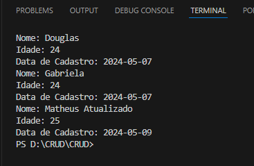

## Getting Started

Fazendo um CRUD com conexão com banco de dados MySQL.
Nesse Projeto estou simulando uma agenda de contato.
#
CREATE = "OK";  
READ = "OK"; 
UPDATE = "OK"; 
DELETE = "OK"; 

Conexão com o banco de dados feita e criação de contatos salvando:
 
Listagem de contatos salvos 
 
Update de contatos 
 
Delete de contatos 
 
## Folder Structure

The workspace contains two folders by default, where:

- `src`: the folder to maintain sources
- `lib`: the folder to maintain dependencies

Meanwhile, the compiled output files will be generated in the `bin` folder by default.

> If you want to customize the folder structure, open `.vscode/settings.json` and update the related settings there.

## Dependency Management

The `JAVA PROJECTS` view allows you to manage your dependencies. More details can be found [here](https://github.com/microsoft/vscode-java-dependency#manage-dependencies).
